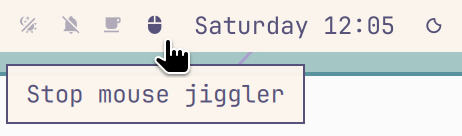

# Mouse Jiggler



A click-to-toggle mouse icon for the [Omarchy](https://omarchy.org) Quattro bar.
It nudges the Hyprland pointer one pixel and puts it back so Zoom, Meet, remote
desktops, websites, and other apps that watch mouse motion stay awake.

**Requires:** Hyprland with `hyprctl` on `PATH`.

## Install

```sh
omarchy plugin add https://github.com/zooltd/omarchy-mouse-jiggler.git --enable
```

## Usage

Click the mouse icon on the menu bar to start or stop jiggling.
Dim icon = off. Full brightness = on.
If Hyprland rejects the cursor move, the icon dims and the tooltip reports the
failure instead of looking enabled while idle.

## Configure

Park it after the Indicators group (center of the bar):

```sh
omarchy bar move youhan.mouse-jiggler --after omarchy.indicators
```

Or on a default bar:

```sh
omarchy bar move youhan.mouse-jiggler --section center --index 1
```

Nudge interval defaults to 25 seconds. Change it in the bar widget settings
(`interval`).

## Why the screensaver can still appear

Omarchy’s screensaver and lock come from the built-in **Stay Awake / idle**
service (`omarchy.idle`). That service uses Quickshell’s `IdleMonitor`. Stay
Awake turns that monitor off so the screensaver does not start.

This plugin does something different. It only moves the pointer with `hyprctl`.
That can wake apps that watch the mouse. It does **not** reset Omarchy’s
`IdleMonitor`, so the screensaver can still fire while the mouse icon is on.

Use **Stay Awake** for the Omarchy screensaver or lock. Use **Mouse jiggler**
for Zoom, Meet, remotes, and other mouse-watching apps. You can run both at
once.

## Remove

```sh
omarchy plugin remove youhan.mouse-jiggler
```

## How it works

`hyprctl cursorpos` reads the current location, then
`hl.dsp.cursor.move` (or the older `movecursor` dispatcher) steps one pixel
right and restores the original coordinates 80 ms later. State is a file at
`~/.local/state/omarchy/indicators/mouse-jiggler`. Presence means on. The bar
widget does not need a daemon.

## Layout

```
manifest.json     Plugin manifest (id: youhan.mouse-jiggler)
BarWidget.qml     Menu bar icon, click-to-toggle, 1px nudge timer
preview.png       Marketplace preview
```

## License

MIT. See [LICENSE](LICENSE).
